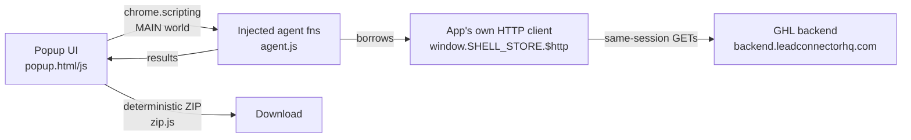

# GHL Toolset

[](https://github.com/legioncodeinc/ghl-toolset/actions/workflows/ci.yml)
[](https://github.com/legioncodeinc/ghl-toolset/blob/main/LICENSE)

A growing set of small Chrome extensions that export, back up, and version-control every facet of a GoHighLevel (HighLevel) sub-account — one focused tool per facet, for agencies and operators who keep their sub-account configuration in git.

> **R&D purposes only.** This toolset is built and published for research and development purposes only. The tools talk to undocumented, internal HighLevel endpoints that can change or break without notice, and this project is not affiliated with or endorsed by HighLevel. Verify everything a tool produces before relying on it anywhere real.

## What it is

A toolbox, not a monolith. Each tool in this repo is a standalone Chrome extension living in its own folder, with its own manifest and its own README. You install only the tool you need, and each tool does exactly one job against the sub-account you already have open in a tab.

This is a deliberate design choice: rather than one bulk extension that migrates or dumps everything from a sub-account in a single pass, the toolset covers the account facet by facet — workflows today, the other surfaces as focused tools as the set grows. Small tools are auditable in one sitting, fail independently, and can be pointed at exactly the data you want without touching the rest.

The first tool is live:

| Tool | Status | What it does |
| --- | --- | --- |
| [`ghl-workflow-exporter`](./ghl-workflow-exporter/) | Available | Exports every workflow in the current sub-account as re-importable JSON in a ZIP |
| `ghl-*` — pipelines, calendars, custom values, templates, funnels, forms, and the rest of the account | Planned | One focused tool per facet; see [Roadmap](#roadmap) |

## Why it exists

HighLevel has no built-in way to get a sub-account's configuration out as data you can diff, review, and restore. Agencies white-labelling GHL manage dozens of sub-accounts where a workflow edit is effectively irreversible — no history, no rollback, no code review.

Bulk export tools that exist are all-or-nothing: they assume you want everything, in one format, through one flow. Real operations need the opposite — pull the pipelines for a migration audit, snapshot the workflows before a release, diff custom values between two sub-accounts. That is a per-facet job, so this repo builds a per-facet toolset.

Every tool in the set follows the same contract, so behavior learned on one transfers to all of them:

- **No credential handling.** Tools borrow the page's own authenticated HTTP client (`window.SHELL_STORE.$http`) inside the tab you are signed into. No token is read, stored, or transmitted by the extension.
- **Read-only.** Every request a tool makes is a GET. Nothing in the sub-account is modified.
- **Minimal permissions.** `activeTab`, `scripting`, `downloads`. No host permissions, no background service worker, no remote code.
- **Works on any GHL host.** White-labelled domains included — tools never hardcode `app.gohighlevel.com`.
- **Deterministic output.** Sorted keys, fixed timestamps, and volatile fields (signed URLs, per-user permission metadata) stripped, so an unchanged sub-account re-exports byte-identically and `git status` stays quiet.

## Quick start

About a minute, no build step:

1. Open `chrome://extensions`.
2. Turn on **Developer mode** (top right).
3. **Load unpacked** → select the `ghl-workflow-exporter` folder from your clone of this repo.
4. Open a HighLevel sub-account tab, click the extension icon, hit **Export workflows**.

## Install

- Chrome or a Chromium browser (Edge, Brave, Arc) with extensions developer mode available
- A signed-in session on the HighLevel sub-account you want to work with

```bash
git clone https://github.com/legioncodeinc/ghl-toolset.git
```

Then load the folder of the tool you want via `chrome://extensions` → **Load unpacked**, as in the quick start. Each tool's folder is self-contained; there is nothing to install or build.

## Usage

Each tool has its own README with its exact flow — start with [`ghl-workflow-exporter/README.md`](./ghl-workflow-exporter/README.md). The shared pattern across all of them:

1. Open the sub-account tab you care about (the tool shows which sub-account it detected).
2. Click the tool's icon and run its action.
3. A ZIP lands in your downloads, shaped for unzipping straight into a git repo.

The typical workflow-export session produces:

```text
legendary-academy-<locationId>/
├── index.json         # one entry per workflow: name, status, version, counts
├── snapshot.json      # everything in one file, for diffing a release as a unit
├── README.md          # provenance note, written into every export
└── workflows/         # one re-importable JSON file per workflow
```

## Roadmap

The goal is a focused tool for every facet of a sub-account that can be read through the app's own session. Planned, in no committed order:

- Pipelines and stages
- Calendars and appointment configuration
- Custom values and fields
- Email / SMS templates and media
- Funnels, websites, and blogs
- Forms and surveys
- Users and roles
- Whatever else the account exposes read-only through its own client

Each lands as its own folder here when it ships — not as modes piled onto an existing tool.

## Configuration

None, by design. No environment variables, no API keys, no options page — see [.env.example](./.env.example) for the rationale. Authentication travels with your signed-in tab and never leaves it.

## Architecture

Every tool is the same three-part shape (MV3, no build step):



- `popup.js` — orchestration: probes the tab, drives the export loop, builds files.
- `agent.js` — functions injected into the page's MAIN world. They must be fully self-contained (no imports, no closures) because they are serialized and re-parsed in the page.
- `zip.js` — dependency-free ZIP writer with a fixed timestamp, so identical content produces an identical archive.

## Development

```bash
git clone https://github.com/legioncodeinc/ghl-toolset.git
cd ghl-toolset
node scripts/validate-manifests.mjs
```

To work on a tool: edit its folder, hit reload on its card in `chrome://extensions`, and re-run it against a test sub-account. To add a new tool: create a `ghl-<facet>-<verb>/` folder with a `manifest.json`, popup, agent, and README following the contract above — the validator and the tool table in this README pick it up. See [CONTRIBUTING.md](./CONTRIBUTING.md) for the full workflow and [CLAUDE.md](./CLAUDE.md) for the codebase conventions in depth.

## Testing

```bash
node scripts/validate-manifests.mjs
```

Passing looks like one `ok` line per tool manifest and exit code 0. This is the same check CI runs; beyond it, each tool is smoke-tested manually against a real (test) sub-account before release.

## Deployment

There is no pipeline to ship: tools are loaded unpacked straight from a checkout of this repo. Distributing via the Chrome Web Store is a future decision; until then, pin consumers to a tag of this repo. Exported data never transits any server — it goes from the browser tab to the ZIP on disk.

## Contributing

PRs welcome, especially for the roadmap facets above — one tool per PR, following the shared contract. See [CONTRIBUTING.md](./CONTRIBUTING.md) for branching, commit conventions, and the local gate before opening a PR.

## License

GHL Toolset is licensed under the [GNU Affero General Public License v3.0](./LICENSE). Each tool in the set carries the same license.
